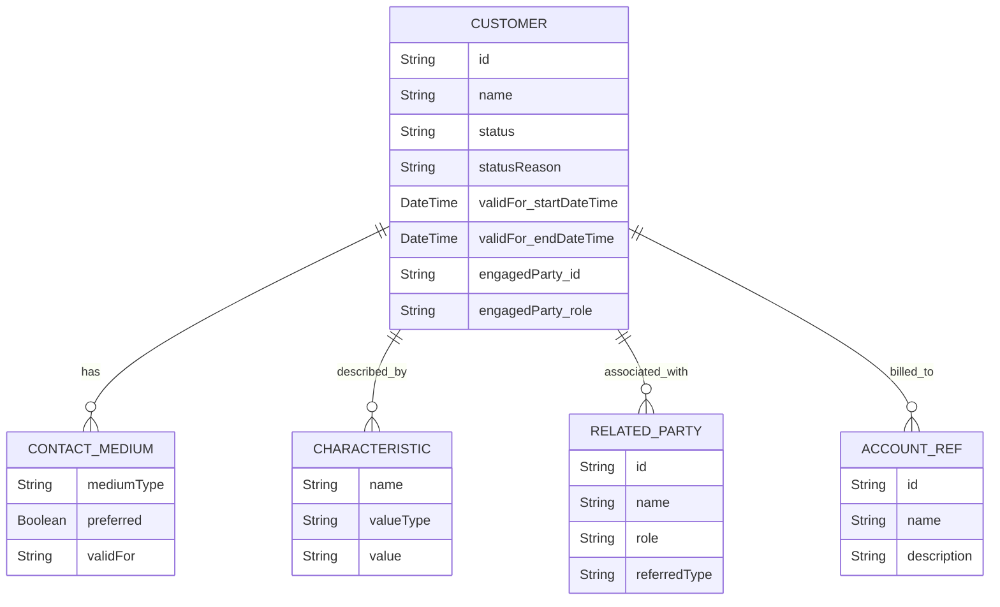
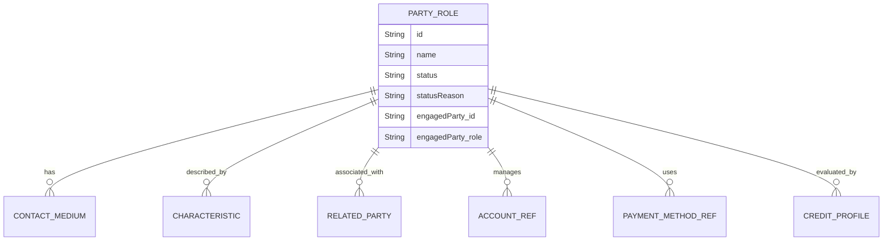
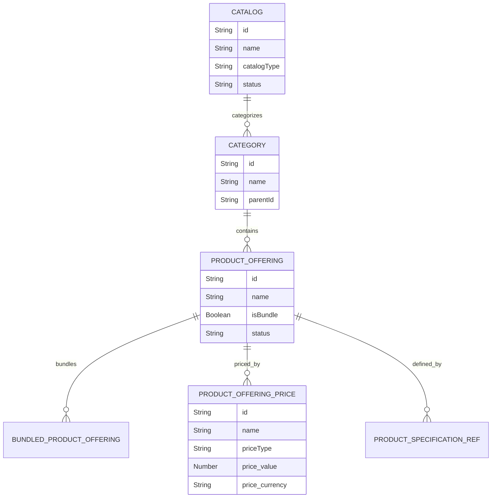
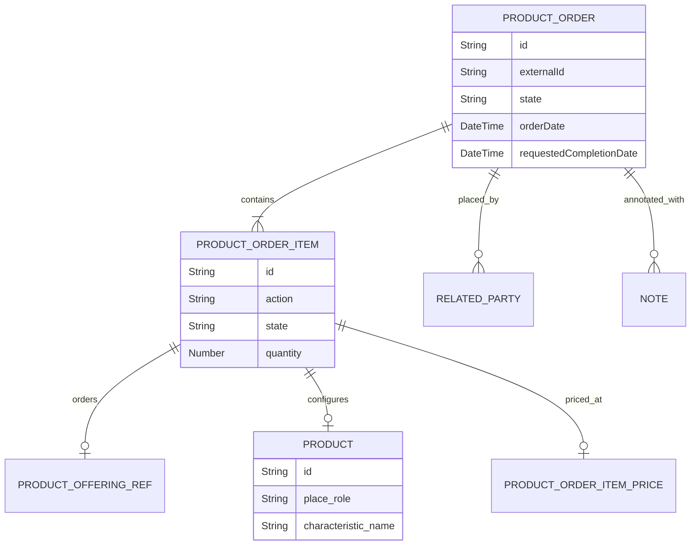
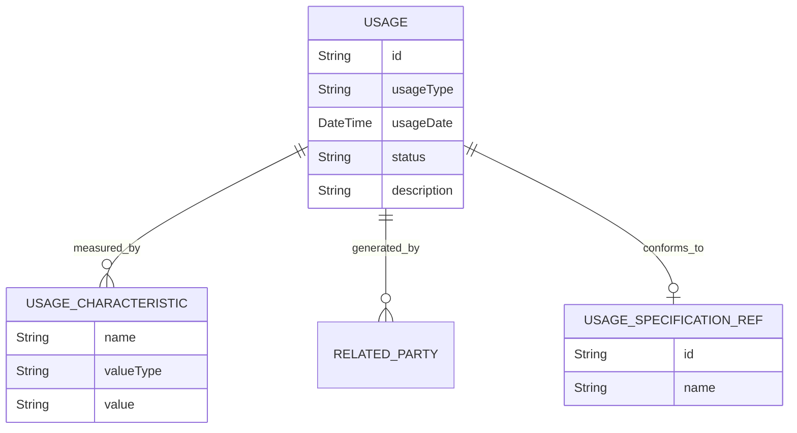
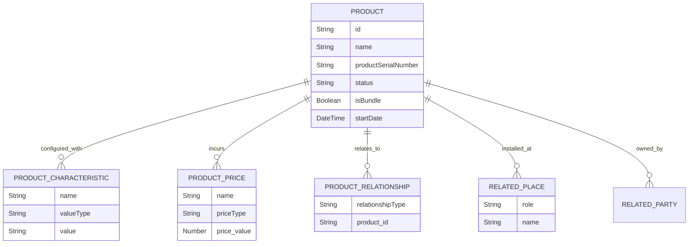

# Jio Subscription Engine - Entity Relationship Diagrams

Here are the high-level Entity Relationship Diagrams (ERDs) for the six TMF modules completed so far. These diagrams represent the core aggregate roots and their domain boundaries based on the TM Forum API specifications we implemented.

Since we are using a **Clean Architecture with strict module isolation**, relationships between modules are stored as *soft links* (References, usually stored as String IDs or HREFs) rather than hard foreign key database constraints.

---

## 1. TMF629 Customer Management
Manages the lifecycle of a Customer. A Customer represents a person or organization that buys products and services from the enterprise or receives free offers or services.

---

## 2. TMF669 Party Role Management
Manages roles played by a Party (Individual or Organization) in a given context (e.g., Billing Administrator, User, Technical Contact).

---

## 3. TMF620 Product Catalog Management
Defines the commercial products available for sale (Product Offerings) and their technical specifications (Product Specifications).

---

## 4. TMF622 Product Order Management
Manages the end-to-end lifecycle of a customer order for products.

---

## 5. TMF635 Usage Management
Records consumption metrics (Usage) generated by products and services for billing and analytics.

---

## 6. TMF637 Product Inventory Management
Tracks the actual instantiated products currently owned/subscribed to by a customer.

